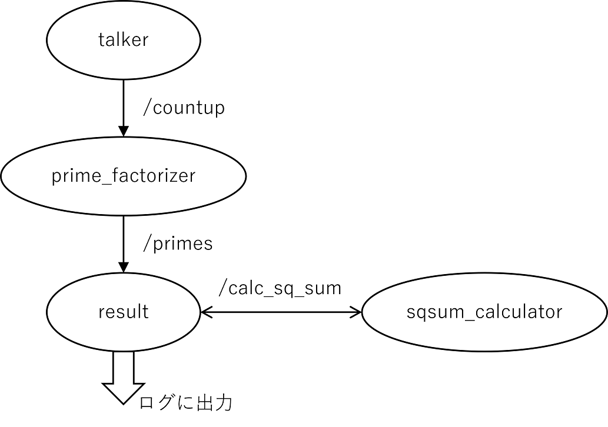

# mypkg
## 概要
<br>
ロボットシステム学の課題で作成したROS2パッケージです。<br>
授業で作成したtalker、listenerの他、整数を2つの平方数の和に分解する機能が入っています。


## 動作確認済み環境
Ubuntu20.04<br>
ROS2 foxy


## 利用にあたって
このパッケージでは[mypkg_msgs](https://github.com/18C1054-S-K/mypkg_msgs "https://github.com/18C1054-S-K/mypkg_msgs")で定義されたメッセージ、サービスを用いています。<br>
そのため、予めmypkg_msgsがcloneされている必要があります。
#### cloneの方法
<ros2_ws>/srcに移動した上で
```
git clone https://github.com/18C1054-S-K/mypkg_msgs
```
(ただし<ros2_ws>はROS2ワークスペースです。)


## ノード
- talker
- listener
  - 省略
- prime_factorizer
  - /countupトピックで受け取った整数を素因数分解して、結果を/primesトピックで渡します。
- result
  - /primesトピックで受け取った素因数分解の結果から、その整数が2つの平方数の和として表せるかを判定し、<br>
    表せないならばその旨を、<br>
    表せるならば/calc_sq_sumサービスに計算させて、結果をログに出力します。
- sqsum_calculator
  - /calc_sq_sumサービスのサーバーです。<br>
    受け取った素因数分解の結果を元に2つの平方数の和に分解して返します。


## トピック
- /countup
  - 省略
- /primes
  - 整数とその素因数分解の情報を渡すためのトピックです。
  - mypkg_msgs/msg/Primes型であり、定義は下記の通りです。
    ```
    int16 original
    int16[] primes
    int16[] indexs
    ```
    originalは元の整数、primesは素因数の配列、indexsは対応する指数の配列です。
  - 例えばoriginal=20なら20=2×2×5なのでprimes=[2,5]、indexs=[2,1]となります。


## サービス
- mypkg_msgs/srv/CalcSqSum
  - 整数の素因数分解を受け取って、2つの平方数の和に分解するサービスです。<br>
  - mypkg_msgs/srv/CalcSqSum型であり、定義は下記の通りです。
    ```
    int16[] primes
    int16[] indexs
    ---
    int16 x
    int16 y
    ```
    リクエストのprimesは素因数の配列、indexsは対応する指数の配列、<br>
    レスポンスのx、yは計算結果の2つの整数です。x > yです。
  - 例えばリクエストがprimes=[2,5]、indexs=[2,1]のとき、これは2×2×5=20を表していて、20は4^2+2^2と分解できるのでレスポンスはx=4、y=2になります。


## launchファイル
- talk_listen
  - 省略
- sqsum
  - 一定時間ごとに0から昇順に整数を2つの平方数の和に分解し、結果をログに出力します。
  - talker、prime_factorizer、sqsum_calculator、resultノードを起動します。<br>
    ノード等の関係は下図のようになっています。<br>
    


## 背景にある数学
二平方和定理によると2より大きな素数pについて、2つの平方数の和で表せる⇔p=1(mod4)　が成り立ちます。<br>
また2つの平方数の和で表せる整数x、yに対し、その積xyも2つの平方数の和で表せます。<br>
(x=a^2+b^2、y=c^2+d^2 ⇒ xy=(ac-bd)^2+(ad+bc)^2)<br>
また明らかに1、2は2つの平方数の和として表せます。<br>
(1=1^2+0^2、2=1^2+1^2)<br>
よって　自然数nが2つの平方数の和として表せる⇔素因数分解したときに3mod4の素因数の指数が偶数　が成り立ちます。<br>
resultノードはこれを利用しています。


## 参考
- [Qiita Markdown記法一覧](https://qiita.com/oreo/items/82183bfbaac69971917f "https://qiita.com/oreo/items/82183bfbaac69971917f")
  - README.mdを書く際に参考にしました。
- [ROS2 Documentation Creating custom msg and srv files](https://docs.ros.org/en/foxy/Tutorials/Beginner-Client-Libraries/Custom-ROS2-Interfaces.html "https://docs.ros.org/en/foxy/Tutorials/Beginner-Client-Libraries/Custom-ROS2-Interfaces.html")
  - ROS2のpythonファイルを書く際に参考にしました。


## 著作権
このパッケージのコードは、下記のスライド(CC-BY-SA 4.0 by Ryuichi Ueda)のものを、本人の許可を得て自身の著作としたものです。<br>
[ryuichiueda/my_slides_robosys_2022](https://github.com/ryuichiueda/my_slides_robosys_2022)


## ライセンス
MITライセンス<br>
LICENSEをお読みください。
